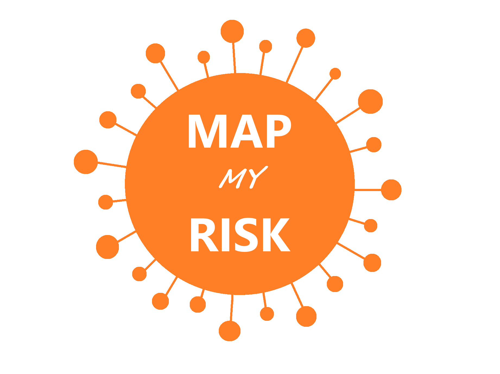

# Mission: Predictable - Map My Risk App
"Mission: Predictable" was a virtual Machine Learning hackathon (WWCode Data Science)

The mission of this hackathon was to solve social challenges related to COVID-19 using machine learning and Amazon SageMaker.

More details regarding the hackathon requirements: [here](./Mission_%20Predictable_Hackathon_Requirements.docx)

Our team name was "Ada Lovelace".  We placed in the top 7 finalists and presented our solution live for judging!

<!-- PROJECT LOGO -->
 

  

  

    The Map My Risk App improves social distancing
     
    by providing current and forecasted COVID-19 transmission rates of geographical areas, 
     
    so the user may plan activities to avoid high risk areas, thereby slowing the spread of the virus.
     
  

  

## Table of Contents

- [Problem Statement](./Lovelace%20Problem%20Statement.pdf)
- [Light Gradient Boosting Model (LGBM)](./master/map_my_risk_codes.ipynb)
- [Full Presentation](./master/Map%20My%20Risk.pptx)
- [Live Presentation and Judging of 7 Finalist Teams ](https://www.youtube.com/watch?v=8IVsd6r0FGc)
